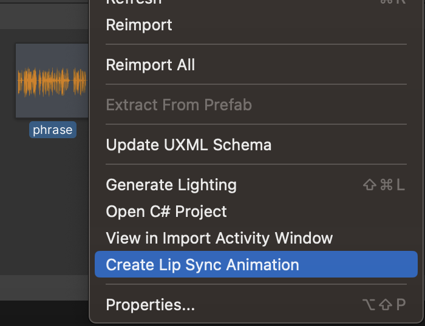

# Audio to Lip Sync

With the Easy Lip Sync plugin creating lip-sync animations is now a breeze.

Please note that for the plugin to work correctly, the duration of the audio file should not exceed 5 minutes. Audio file size should not exceed 50 MB.

To create an animation from an audio file using the editor, you need to do the following:

1. In Assets Folder in Unity Editor select the sound asset you want to generate the animation from;
2. From the context menu select **Create Lip Sync Animation** tab.

<figure><figcaption>
<strong>Create Lip Sync Animation in context menu</strong>
</figcaption></figure>

Another way to go there is to go to **Tools -> Easy Lip Sync -> Create Lip Sync Animation**.

<figure><figcaption>
<strong>Create Lip Sync Animation in Unity Editor</strong>
</figcaption></figure>

<figure><figcaption>
<strong>Create Lip Sync Animation in Unity Editor</strong>
</figcaption></figure>

After that the window pops up.

<figure><figcaption>
<strong>Create Lip Sync Animation window</strong>
</figcaption></figure>

Plugin supports all popular audio formats (wav, mp3, flac, aiff, ogg). The target audio format is wav mono 16 bit LE, the rest will be converted to it automatically. Please note that you will not be able to improve the result of lip sync with sound quality higher than wav mono 16 bit.

To create an animation you need to choose the **sound** for which the animation will be created and select the **avatar model** to which the animation will be applied. The model must have an attached Animator Controller. For example, you can open an example scene from **Easy Lip Sync/Examples/1 - Play Animation** and choose Matilda from there. You can use your custom 3d model with ARKit Face Blendshapes with any node names (only the names of the blendshapes must be correct). All blendshapes on child Animator objects with matched names will be animated.

Besides, you can choose an **emotion** for lip sync animation and enable or disable **eye blinking**.

By clicking **Generate Lip Sync** you get an animation after a short wait. You need to select a folder to save animations in json (.json) and unity (.anim) format. You can work with the .anim file in the same way as with normal Unity animation. The .json file can be useful for debugging and can be removed.

<figure><figcaption>
Generated animation and speech in the Assets folder
</figcaption></figure>
